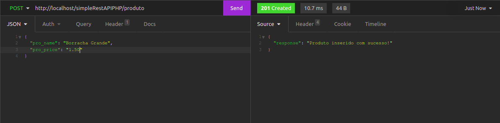
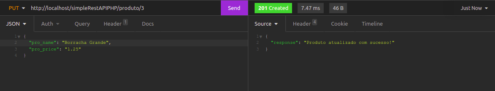
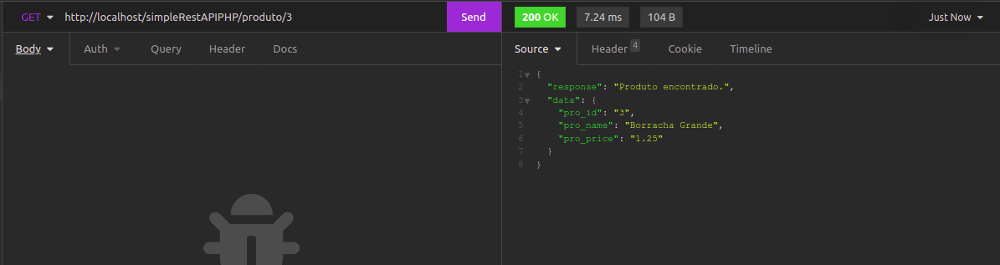
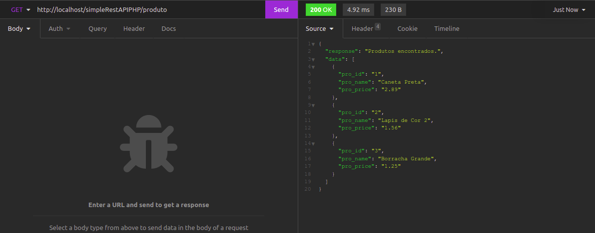
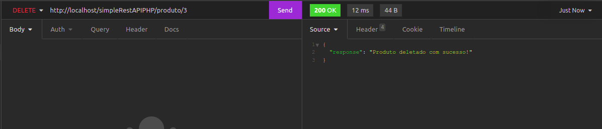

# CRUD com API REST

Este projeto consiste em uma API Rest simples de um CRUD de produtos. Essa API foi construída para ser consumida pelo projeto [CRUD em Angular](https://github.com/LucasLevyOB/front_end--project--simple_angular_crud).

**\*Projeto desenvolvido entre 06 de Julho de 2020 e 06 de Agosto de 2020**

## Tecnologias utilizadas

1. PHP
2. PDO
3. Composer
4. Autoload
5. MVC
6. POO
7. Tratamento de Erros
8. Validação de Dados
9. JSON
10. MySQL

## Executar localmente

Para executar em sua máquina, siga os passos.

1. Baixe ou clone o repositório;
2. Caso tenha feito o download, descompacte a pasta.
3. Você deve renomear para **simpleRestAPIPHP**;
4. Mova a pasta para o diretório do seu servidor PHP

## Como consumir a API

A URL base da API após **renomear** a pasta é: http://localhost/simpleRestAPIPHP/produto

A partir dela você poderá utilizar os métodos HTTP: POST, GET PUT e DELETE.

#### 1. Método POST

Para cadastrar um produto, você deve:

1. Utilizar a URL base;

```url
  http://localhost/simpleRestAPIPHP/produto
```

2. Selecionar o método POST;
3. E passar o seguinte padrão JSON como corpo:

```json
{
  "pro_name": "Nome do Produto",
  "pro_price": "Preço do Produto"
}
```

**Exemplo**
Neste exemplo e nos próximos, eu utilizarei o **Insomnia** como cliente HTTP:


#### 2. Método PUT

Para atualizar um produto, você deve:

1. Utilizar a URL base;

```url
  http://localhost/simpleRestAPIPHP/produto
```

2. Em seguida adicionar uma barra e o ID do produto que deseja atualizar;

```url
  http://localhost/simpleRestAPIPHP/produto/id_produto
```

3. Selecionar o método PUT
4. E passar o mesmo padrão JSON da inserção de um produto.

**Exemplo**


A resposta informa que o produto foi atualizado.

### 3. Método GET (Único Produto)

Para selecionar um único produto do banco, você deve:

1. Utilizar a URL base;

```url
  http://localhost/simpleRestAPIPHP/produto
```

2. Em seguida adicionar uma barra e o ID do produto que deseja ver;

```url
  http://localhost/simpleRestAPIPHP/produto/id_produto
```

3. Selecionar o método GET

**Exemplo**


Após a requesição a API responde com um JSON, contendo um Data(dados do produto) e um Response, informando que o produto foi encontrado, ou se ocorreu algum erro.

### 4. Método GET (Todos os Produtos)

Para selecionar todos os produtos do banco, você deve:

1. Utilizar a URL base;

```url
  http://localhost/simpleRestAPIPHP/produto
```

2. Selecionar o método GET

**Exemplo**


São retornados todos os produtos contidos no banco de dados ou um erro.

#### 5. Método DELETE

Para deletar um produto você deve:

1. Utilizar a URL base;

```url
  http://localhost/simpleRestAPIPHP/produto
```

2. Em seguida adicionar uma barra e o ID do produto que deseja deletar;

```url
  http://localhost/simpleRestAPIPHP/produto/id_produto
```

1. E selecionar o método Delete.

**Exemplo**


A resposta informa que o produto foi deletado, ou se ocorreu algum problema.
